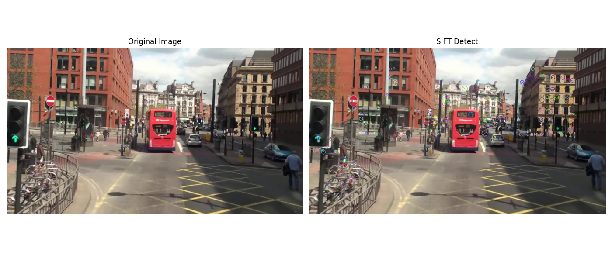
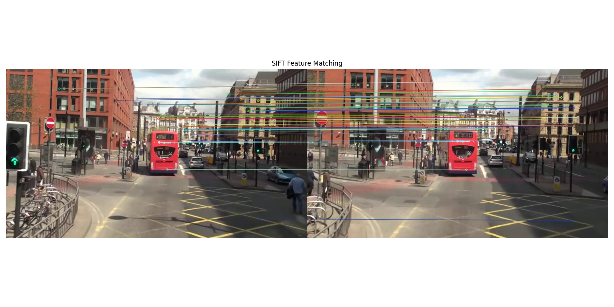
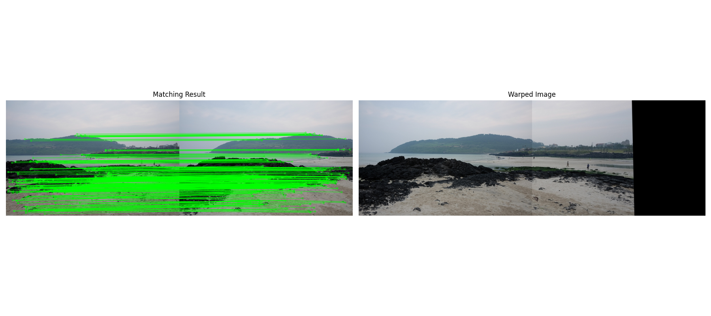
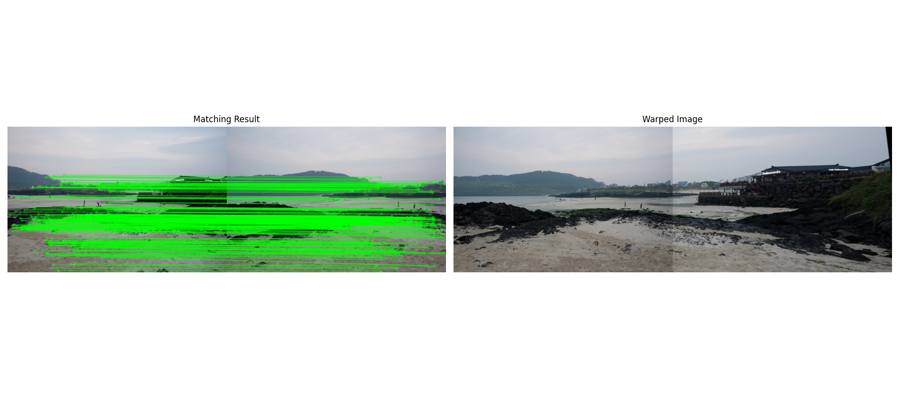

# 컴퓨터 비전
본 저장소는 OpenCV를 이용한 컴퓨터비전 과제를 정리한 페이지입니다.  
과제는 총 3개로 구성되어 있습니다.

1. SIFT 기반 특징점 검출 및 시각화  
2. SIFT 기반 특징점 매칭  
3. SIFT + Homography 기반 이미지 정렬  

각 과제마다 문제 설명, 핵심 코드, 중간 결과물, 최종 결과물, 전체 코드를 함께 정리하였습니다.

---

# 1번 과제: SIFT 기반 특징점 검출 및 시각화

## 1. 문제 설명
주어진 이미지 `mot_color70.jpg`를 이용하여 SIFT(Scale-Invariant Feature Transform) 알고리즘으로 특징점을 검출하고 이를 시각화하였다.  
SIFT는 이미지의 크기 변화와 회전에 비교적 강인한 특징점을 찾는 알고리즘으로, 특징점의 위치뿐 아니라 크기와 방향 정보도 함께 표현할 수 있다.

## 2. 요구사항
- `cv.SIFT_create()`를 사용하여 SIFT 객체를 생성
- `detectAndCompute()`를 사용하여 특징점을 검출
- `cv.drawKeypoints()`를 사용하여 특징점을 이미지에 시각화
- Matplotlib을 이용하여 원본 이미지와 특징점이 시각화된 이미지를 나란히 출력

## 3. 사용한 주요 함수

### `cv.SIFT_create()`
SIFT 특징점 검출기를 생성하는 함수이다.  
`nfeatures` 값을 조절하면 검출할 특징점 개수를 제한할 수 있다.

### `detectAndCompute()`
입력 이미지에서 특징점(keypoints)을 검출하고, 각 특징점에 대한 기술자(descriptor)를 계산하는 함수이다.

### `cv.drawKeypoints()`
검출된 특징점을 이미지 위에 그려 시각화하는 함수이다.  
`cv.DRAW_MATCHES_FLAGS_DRAW_RICH_KEYPOINTS` 옵션을 사용하면 특징점의 방향과 크기도 함께 표시된다.

## 4. 핵심 코드

### SIFT 객체 생성
~~~python
sift = cv.SIFT_create(nfeatures=200)
~~~

### 특징점 검출 및 기술자 계산
~~~python
keypoints, descriptors = sift.detectAndCompute(gray, None)
~~~

### 특징점 시각화
~~~python
result = cv.drawKeypoints(
    img,
    keypoints,
    None,
    flags=cv.DRAW_MATCHES_FLAGS_DRAW_RICH_KEYPOINTS
)
~~~

## 5. 최종 결과물

### 특징점 시각화 결과
원본 이미지와 SIFT 특징점이 시각화된 이미지를 좌우로 연결하여 비교하였다.

  

### 해석
SIFT를 이용하면 이미지에서 크기 변화나 회전에 비교적 강인한 특징점을 검출할 수 있다.  
또한 `DRAW_RICH_KEYPOINTS` 옵션을 사용하면 각 특징점의 방향과 크기까지 함께 확인할 수 있어 특징점의 성질을 더 직관적으로 해석할 수 있다.

## 6. 전체 코드

~~~python
import cv2 as cv                                  # OpenCV 라이브러리를 cv라는 이름으로 불러옴
import matplotlib.pyplot as plt                  # 결과 이미지를 출력하기 위해 matplotlib.pyplot을 plt로 불러옴
import os                                        # 결과 이미지를 저장할 폴더를 만들기 위해 os를 불러옴

# 결과 이미지를 저장할 result 폴더를 생성
os.makedirs('result', exist_ok=True)

# mot_color70.jpg 파일을 컬러 이미지로 읽어서 img 변수에 저장
img = cv.imread('mot_color70.jpg')

# 이미지가 정상적으로 읽혔는지 확인
if img is None:
    print("이미지를 불러올 수 없습니다.")          # 이미지를 읽지 못했을 때 오류 메시지 출력
    exit()                                        # 프로그램 종료

# OpenCV는 이미지를 BGR 형식으로 읽기 때문에
# matplotlib에서 올바른 색상으로 보기 위해 RGB 형식으로 변환
img_rgb = cv.cvtColor(img, cv.COLOR_BGR2RGB)

# SIFT 특징점 검출은 보통 그레이스케일 이미지에서 수행하므로
# 컬러 이미지를 그레이스케일 이미지로 변환
gray = cv.cvtColor(img, cv.COLOR_BGR2GRAY)

# SIFT 객체를 생성
# nfeatures=200은 검출할 특징점 개수를 대략 제한하는 옵션
# 특징점이 너무 많으면 이 값을 줄이고, 더 많이 보고 싶으면 값을 늘리면 됨
sift = cv.SIFT_create(nfeatures=200)

# detectAndCompute()를 사용하여
# gray 이미지에서 특징점(keypoints)을 검출하고 기술자(descriptors)를 계산
# 첫 번째 반환값 keypoints는 특징점 정보 목록
# 두 번째 반환값 descriptors는 각 특징점을 수치 벡터로 표현한 기술자
keypoints, descriptors = sift.detectAndCompute(gray, None)

# drawKeypoints()를 사용하여 원본 이미지 위에 특징점을 그림
# None은 결과 이미지를 새로 생성하겠다는 의미
# flags=cv.DRAW_MATCHES_FLAGS_DRAW_RICH_KEYPOINTS 옵션은
# 특징점의 위치뿐 아니라 크기와 방향도 함께 시각화함
result = cv.drawKeypoints(
    img,
    keypoints,
    None,
    flags=cv.DRAW_MATCHES_FLAGS_DRAW_RICH_KEYPOINTS
)

# drawKeypoints() 결과도 OpenCV 형식(BGR)이므로
# matplotlib에 출력하기 위해 RGB 형식으로 변환
result_rgb = cv.cvtColor(result, cv.COLOR_BGR2RGB)

# 원본 이미지를 result 폴더에 저장
cv.imwrite('result/mot_color70_original.jpg', img)

# 특징점이 그려진 결과 이미지를 result 폴더에 저장
cv.imwrite('result/mot_color70_sift_keypoints.jpg', result)

# 전체 출력 창 크기를 설정
plt.figure(figsize=(14, 6))

# 1행 2열 중 첫 번째 위치에 원본 이미지를 출력
plt.subplot(1, 2, 1)

# RGB로 변환한 원본 이미지를 화면에 표시
plt.imshow(img_rgb)

# 첫 번째 이미지 제목을 설정
plt.title('Original Image')

# 축 눈금을 보이지 않게 설정
plt.axis('off')

# 1행 2열 중 두 번째 위치에 특징점 시각화 결과를 출력
plt.subplot(1, 2, 2)

# 특징점이 그려진 이미지를 화면에 표시
plt.imshow(result_rgb)

# 두 번째 이미지 제목을 설정
plt.title('SIFT Keypoints')

# 축 눈금을 보이지 않게 설정
plt.axis('off')

# subplot 간격을 자동으로 조정하여 보기 좋게 정리
plt.tight_layout()

# 최종 결과를 화면에 출력
plt.show()
~~~

---

# 2번 과제: SIFT 기반 특징점 매칭

## 1. 문제 설명
두 개의 이미지 `mot_color70.jpg`, `mot_color83.jpg`를 입력받아 SIFT 특징점 기반으로 매칭을 수행하고 결과를 시각화하였다.  
두 이미지에서 검출된 특징점 중 서로 가장 유사한 특징점들을 찾아 대응 관계를 만들고, 이를 선으로 연결하여 매칭 결과를 확인하였다.

## 2. 요구사항
- `cv.imread()`를 사용하여 두 개의 이미지를 불러옴
- `cv.SIFT_create()`를 사용하여 특징점을 추출
- `cv.BFMatcher()` 또는 `cv.FlannBasedMatcher()`를 사용하여 두 영상 간 특징점을 매칭
- `cv.drawMatches()`를 사용하여 매칭 결과를 시각화
- Matplotlib을 이용하여 매칭 결과를 출력

## 3. 사용한 주요 함수

### `cv.SIFT_create()`
두 이미지에서 특징점과 기술자를 추출하기 위한 SIFT 객체를 생성하는 함수이다.

### `cv.FlannBasedMatcher()`
특징점 기술자 간 최근접 이웃을 빠르게 탐색하여 매칭을 수행하는 매처 객체이다.  
SIFT와 같은 실수형 기술자에 적합하다.

### `knnMatch()`
각 특징점에 대해 최근접 이웃 여러 개를 찾는 함수이다.  
보통 최근접 이웃 2개를 구한 뒤, 거리 비율 테스트를 적용하여 잘못된 매칭을 줄인다.

### `cv.drawMatches()`
두 이미지 사이의 매칭된 특징점들을 선으로 연결하여 시각화하는 함수이다.

## 4. 핵심 코드

### 특징점 검출 및 기술자 계산
~~~python
kp1, des1 = sift.detectAndCompute(gray1, None)
kp2, des2 = sift.detectAndCompute(gray2, None)
~~~

### FLANN 매처 생성
~~~python
index_params = dict(algorithm=1, trees=5)
search_params = dict(checks=50)
flann = cv.FlannBasedMatcher(index_params, search_params)
~~~

### KNN 매칭 및 거리 비율 테스트
~~~python
matches = flann.knnMatch(des1, des2, k=2)

for m, n in matches:
    if m.distance < 0.75 * n.distance:
        good_matches.append(m)
~~~

## 5. 최종 결과물

### 특징점 매칭 결과
두 이미지에서 대응되는 특징점들을 선으로 연결하여 매칭 결과를 시각화하였다.

  

### 해석
SIFT 특징점은 회전과 크기 변화에 비교적 강인하므로 서로 다른 시점이나 약간의 변형이 있는 두 이미지에서도 안정적으로 매칭할 수 있다.  
또한 FLANN 기반 매칭과 최근접 이웃 거리 비율 테스트를 함께 사용하면 오매칭을 줄이고 더 정확한 대응점을 얻을 수 있다.

## 6. 전체 코드

~~~python
import cv2 as cv                                  # OpenCV 라이브러리를 cv라는 이름으로 불러옴
import matplotlib.pyplot as plt                  # 결과 시각화를 위해 matplotlib.pyplot을 plt로 불러옴
import os                                        # 결과 이미지를 저장할 폴더를 만들기 위해 os를 불러옴

# 결과 이미지를 저장할 result 폴더를 생성
os.makedirs('result', exist_ok=True)

# 첫 번째 이미지를 컬러 형식으로 읽어서 img1 변수에 저장
img1 = cv.imread('mot_color70.jpg')

# 두 번째 이미지를 컬러 형식으로 읽어서 img2 변수에 저장
img2 = cv.imread('mot_color83.jpg')

# 두 이미지 중 하나라도 정상적으로 읽히지 않았는지 확인
if img1 is None or img2 is None:
    print("이미지를 불러올 수 없습니다.")          # 오류 메시지를 출력
    exit()                                        # 프로그램 종료

# 특징점 검출은 보통 그레이스케일 이미지에서 수행하므로
# 첫 번째 이미지를 그레이스케일로 변환
gray1 = cv.cvtColor(img1, cv.COLOR_BGR2GRAY)

# 두 번째 이미지를 그레이스케일로 변환
gray2 = cv.cvtColor(img2, cv.COLOR_BGR2GRAY)

# SIFT 객체를 생성
# 기본 설정으로 생성했으며 필요하면 nfeatures 등을 조정할 수 있음
sift = cv.SIFT_create()

# 첫 번째 이미지에서 특징점과 기술자를 계산
# kp1은 특징점 목록, des1은 특징점 기술자 배열
kp1, des1 = sift.detectAndCompute(gray1, None)

# 두 번째 이미지에서 특징점과 기술자를 계산
# kp2는 특징점 목록, des2는 특징점 기술자 배열
kp2, des2 = sift.detectAndCompute(gray2, None)

# 기술자가 정상적으로 계산되었는지 확인
# 이미지에 특징점이 거의 없으면 기술자가 None이 될 수 있음
if des1 is None or des2 is None:
    print("특징점을 충분히 검출하지 못했습니다.")   # 오류 메시지를 출력
    exit()                                        # 프로그램 종료

# FLANN 매칭을 위한 인덱스 파라미터를 설정
# algorithm=1은 KD-Tree 방식을 의미하며 SIFT처럼 float descriptor에 적합함
# trees=5는 KD-Tree 개수를 의미하며 보통 4~8 정도를 많이 사용함
index_params = dict(algorithm=1, trees=5)

# FLANN 탐색 파라미터를 설정
# checks 값이 클수록 더 많이 탐색하여 정확도가 올라갈 수 있지만 속도는 느려질 수 있음
search_params = dict(checks=50)

# FLANN 기반 매처 객체를 생성
flann = cv.FlannBasedMatcher(index_params, search_params)

# knnMatch()를 사용하여 각 특징점에 대해 가장 가까운 이웃 2개를 찾음
# k=2로 설정한 이유는 ratio test를 적용하기 위해서임
matches = flann.knnMatch(des1, des2, k=2)

# 좋은 매칭만 저장할 빈 리스트를 생성
good_matches = []

# 모든 매칭 쌍에 대해 반복
for pair in matches:
    # 간혹 매칭 결과가 2개 미만인 경우가 있을 수 있으므로 길이를 먼저 확인
    if len(pair) == 2:
        # 가장 가까운 매칭을 m, 두 번째로 가까운 매칭을 n에 저장
        m, n = pair

        # Lowe의 ratio test를 적용
        # 첫 번째 후보의 거리가 두 번째 후보 거리의 0.75배보다 작으면
        # 더 신뢰할 수 있는 매칭이라고 판단하여 good_matches에 추가
        if m.distance < 0.75 * n.distance:
            good_matches.append(m)

# 좋은 매칭들을 거리 기준으로 정렬
# distance가 작을수록 두 특징점이 더 비슷하다고 볼 수 있음
good_matches = sorted(good_matches, key=lambda x: x.distance)

# 너무 많은 매칭이 한꺼번에 보이면 복잡하므로 상위 50개만 선택
good_matches = good_matches[:50]

# drawMatches()를 사용하여 두 이미지 사이의 매칭 결과를 시각화
# flags=cv.DrawMatchesFlags_NOT_DRAW_SINGLE_POINTS 옵션은
# 매칭되지 않은 단일 특징점은 그리지 않고 매칭된 점들만 표시함
matched_img = cv.drawMatches(
    img1,
    kp1,
    img2,
    kp2,
    good_matches,
    None,
    flags=cv.DrawMatchesFlags_NOT_DRAW_SINGLE_POINTS
)

# 매칭 결과 이미지를 result 폴더에 저장
cv.imwrite('result/mot_color70_83_matching.jpg', matched_img)

# drawMatches() 결과는 BGR 형식이므로
# matplotlib 출력을 위해 RGB 형식으로 변환
matched_img_rgb = cv.cvtColor(matched_img, cv.COLOR_BGR2RGB)

# 출력 창 크기를 설정
plt.figure(figsize=(16, 8))

# 매칭 결과 이미지를 출력
plt.imshow(matched_img_rgb)

# 그래프 제목을 설정
plt.title('SIFT Feature Matching')

# 축 눈금을 숨김
plt.axis('off')

# 그래프 간격을 자동으로 정리
plt.tight_layout()

# 최종 결과를 화면에 출력
plt.show()
~~~

---

# 3번 과제: SIFT + Homography 기반 이미지 정렬

## 1. 문제 설명
SIFT 특징점을 사용하여 두 이미지 간 대응점을 찾고, 이를 바탕으로 호모그래피(Homography)를 계산하여 하나의 이미지 위에 정렬하였다.  
샘플 파일 `img1.jpg`, `img2.jpg`, `img3.jpg` 중 2개를 선택하여 실험할 수 있다.

## 2. 요구사항
- `cv.imread()`를 사용하여 두 개의 이미지를 불러옴
- `cv.SIFT_create()`를 사용하여 특징점을 검출
- `cv.BFMatcher()`와 `knnMatch()`를 사용하여 특징점을 매칭하고, 좋은 매칭점만 선별
- `cv.findHomography()`를 사용하여 호모그래피 행렬을 계산
- `cv.warpPerspective()`를 사용하여 한 이미지를 변환하여 다른 이미지와 정렬
- 변환된 이미지(Warped Image)와 특징점 매칭 결과(Matching Result)를 나란히 출력

## 3. 사용한 주요 함수

### `cv.BFMatcher()`
특징점 기술자 간의 거리를 직접 계산하여 매칭을 수행하는 매처 객체이다.  
SIFT에서는 `cv.NORM_L2`를 사용한다.

### `knnMatch()`
각 특징점에 대해 최근접 이웃 2개를 구하는 함수이다.  
거리 비율 테스트와 함께 사용하면 잘못된 대응점을 줄일 수 있다.

### `cv.findHomography()`
두 이미지의 대응점들을 이용하여 호모그래피 행렬을 계산하는 함수이다.  
`cv.RANSAC` 옵션을 사용하면 이상치의 영향을 줄일 수 있다.

### `cv.warpPerspective()`
계산된 호모그래피 행렬을 이용하여 한 이미지를 다른 이미지의 좌표계에 맞게 변환하는 함수이다.

## 4. 핵심 코드

### 특징점 매칭과 좋은 매칭점 선별
~~~python
matches = bf.knnMatch(des1, des2, k=2)

for m, n in matches:
    if m.distance < 0.7 * n.distance:
        good_matches.append(m)
~~~

### 호모그래피 계산
~~~python
H, mask = cv.findHomography(src_pts, dst_pts, cv.RANSAC, 5.0)
~~~

### 이미지 워핑
~~~python
warped = cv.warpPerspective(img1, H, (w1 + w2, max(h1, h2)))
warped[0:h2, 0:w2] = img2
~~~

## 5. 최종 결과물

### Warped Image 결과
호모그래피 행렬을 이용하여 첫 번째 이미지를 두 번째 이미지 기준 좌표계로 변환하고, 두 번째 이미지를 기준 영상으로 배치하였다.

  
  

### 해석
SIFT 특징점과 BFMatcher 기반 매칭으로 두 이미지의 대응점을 찾고, RANSAC 기반 호모그래피 추정을 통해 이상치의 영향을 줄였다.  
그 결과 한 이미지를 다른 이미지 좌표계에 맞게 변환할 수 있었으며, 두 이미지가 같은 평면 또는 유사한 시점 관계를 가진 경우 정렬 결과를 효과적으로 확인할 수 있었다.

## 7. 전체 코드

~~~python
import cv2 as cv                                  # OpenCV 라이브러리를 cv라는 이름으로 불러옴
import numpy as np                               # 좌표 배열과 행렬 처리를 위해 numpy를 np라는 이름으로 불러옴
import matplotlib.pyplot as plt                  # 결과 시각화를 위해 matplotlib.pyplot을 plt로 불러옴
import os                                        # 결과 이미지를 저장할 폴더를 만들기 위해 os를 불러옴

# 결과 이미지를 저장할 result 폴더를 생성
os.makedirs('result', exist_ok=True)

# 첫 번째 이미지를 컬러 형식으로 읽어서 img1 변수에 저장
# 필요하면 img1.jpg 대신 img3.jpg 등으로 바꿔서 사용할 수 있음
img1 = cv.imread('img1.jpg')

# 두 번째 이미지를 컬러 형식으로 읽어서 img2 변수에 저장
# 실제 파일명이 다르면 이 부분을 바꾸면 됨
img2 = cv.imread('img2.jpg')

# 두 이미지 중 하나라도 정상적으로 읽히지 않았는지 확인
if img1 is None or img2 is None:
    print("이미지를 불러올 수 없습니다.")          # 오류 메시지를 출력
    exit()                                        # 프로그램 종료

# 특징점 검출을 위해 첫 번째 이미지를 그레이스케일로 변환
gray1 = cv.cvtColor(img1, cv.COLOR_BGR2GRAY)

# 특징점 검출을 위해 두 번째 이미지를 그레이스케일로 변환
gray2 = cv.cvtColor(img2, cv.COLOR_BGR2GRAY)

# SIFT 객체를 생성
sift = cv.SIFT_create()

# 첫 번째 이미지에서 특징점과 기술자를 계산
kp1, des1 = sift.detectAndCompute(gray1, None)

# 두 번째 이미지에서 특징점과 기술자를 계산
kp2, des2 = sift.detectAndCompute(gray2, None)

# 기술자가 정상적으로 계산되었는지 확인
if des1 is None or des2 is None:
    print("특징점을 충분히 검출하지 못했습니다.")   # 오류 메시지를 출력
    exit()                                        # 프로그램 종료

# BFMatcher 객체를 생성
# SIFT 기술자는 float 기반이므로 거리 계산 방식으로 NORM_L2를 사용
bf = cv.BFMatcher(cv.NORM_L2)

# knnMatch()를 사용하여 각 특징점마다 최근접 이웃 2개를 찾음
# k=2는 ratio test를 적용하기 위한 설정
matches = bf.knnMatch(des1, des2, k=2)

# 좋은 매칭만 저장할 빈 리스트를 생성
good_matches = []

# 모든 매칭 결과에 대해 반복
for pair in matches:
    # 매칭 쌍이 2개 모두 존재하는지 먼저 확인
    if len(pair) == 2:
        # 첫 번째 최근접 이웃을 m, 두 번째 최근접 이웃을 n에 저장
        m, n = pair

        # 거리 비율 테스트를 적용하여 신뢰할 수 있는 매칭만 선택
        # 첫 번째 후보가 두 번째 후보보다 충분히 더 가까우면 좋은 매칭으로 간주
        if m.distance < 0.7 * n.distance:
            good_matches.append(m)

# 호모그래피 계산에는 최소 4개의 좋은 매칭이 필요하므로 개수를 확인
if len(good_matches) < 4:
    print("좋은 매칭점이 부족하여 호모그래피를 계산할 수 없습니다.")
    exit()

# 첫 번째 이미지에서 좋은 매칭점의 좌표를 추출
# m.queryIdx는 첫 번째 이미지 특징점 인덱스임
# findHomography() 입력 형식에 맞게 (-1, 1, 2) 형태로 변환
src_pts = np.float32([kp1[m.queryIdx].pt for m in good_matches]).reshape(-1, 1, 2)

# 두 번째 이미지에서 대응되는 좋은 매칭점의 좌표를 추출
# m.trainIdx는 두 번째 이미지 특징점 인덱스임
# findHomography() 입력 형식에 맞게 (-1, 1, 2) 형태로 변환
dst_pts = np.float32([kp2[m.trainIdx].pt for m in good_matches]).reshape(-1, 1, 2)

# RANSAC을 사용하여 호모그래피 행렬을 계산
# RANSAC은 이상치(outlier)의 영향을 줄이는 데 도움을 줌
# H는 계산된 호모그래피 행렬
# mask는 각 매칭점이 inlier인지 outlier인지 나타내는 마스크
H, mask = cv.findHomography(src_pts, dst_pts, cv.RANSAC, 5.0)

# 호모그래피 계산이 정상적으로 되었는지 확인
if H is None:
    print("호모그래피 계산에 실패했습니다.")
    exit()

# 두 이미지의 높이와 너비를 구함
h1, w1 = img1.shape[:2]
h2, w2 = img2.shape[:2]

# 첫 번째 이미지를 두 번째 이미지 좌표계로 워핑
# 출력 크기는 문제 힌트에 따라 (w1 + w2, max(h1, h2))로 설정
warped = cv.warpPerspective(img1, H, (w1 + w2, max(h1, h2)))

# 두 번째 이미지를 결과 영상의 왼쪽 상단에 배치
# 이렇게 하면 기준 이미지 위에 변환된 이미지가 정렬된 형태로 보일 수 있음
warped[0:h2, 0:w2] = img2

# RANSAC에서 살아남은 inlier 매칭만 시각화하기 위해 mask를 1차원 리스트로 변환
matches_mask = mask.ravel().tolist()

# drawMatches()를 사용하여 특징점 매칭 결과를 시각화
# matchesMask를 넣으면 RANSAC에서 inlier로 판단된 매칭만 그려짐
matching_result = cv.drawMatches(
    img1,
    kp1,
    img2,
    kp2,
    good_matches,
    None,
    matchColor=(0, 255, 0),
    singlePointColor=None,
    matchesMask=matches_mask,
    flags=cv.DrawMatchesFlags_NOT_DRAW_SINGLE_POINTS
)

# 매칭 결과 이미지를 result 폴더에 저장
cv.imwrite('result/homography_matching.jpg', matching_result)

# 워핑된 결과 이미지를 result 폴더에 저장
cv.imwrite('result/homography_warped.jpg', warped)

# 워핑된 결과 이미지는 BGR 형식이므로 matplotlib 출력을 위해 RGB로 변환
warped_rgb = cv.cvtColor(warped, cv.COLOR_BGR2RGB)

# 매칭 결과 이미지도 BGR 형식이므로 RGB로 변환
matching_result_rgb = cv.cvtColor(matching_result, cv.COLOR_BGR2RGB)

# 전체 출력 창 크기를 설정
plt.figure(figsize=(18, 8))

# 1행 2열 중 첫 번째 위치에 매칭 결과를 출력
plt.subplot(1, 2, 1)

# 특징점 매칭 결과 이미지를 화면에 표시
plt.imshow(matching_result_rgb)

# 첫 번째 결과 제목을 설정
plt.title('Matching Result')

# 축 눈금을 보이지 않게 설정
plt.axis('off')

# 1행 2열 중 두 번째 위치에 워핑된 정렬 결과를 출력
plt.subplot(1, 2, 2)

# 호모그래피로 정렬된 이미지를 화면에 표시
plt.imshow(warped_rgb)

# 두 번째 결과 제목을 설정
plt.title('Warped Image')

# 축 눈금을 보이지 않게 설정
plt.axis('off')

# subplot 간격을 자동으로 정리
plt.tight_layout()

# 최종 결과를 화면에 출력
plt.show()
~~~

1. SIFT를 이용한 특징점 검출 및 시각화  
2. SIFT와 FLANN을 이용한 두 이미지 간 특징점 매칭  
3. SIFT, BFMatcher, Homography를 이용한 이미지 정렬
