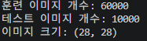
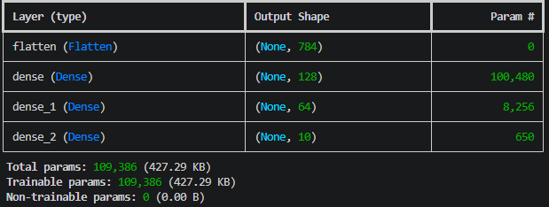
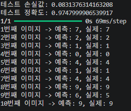
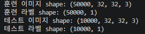
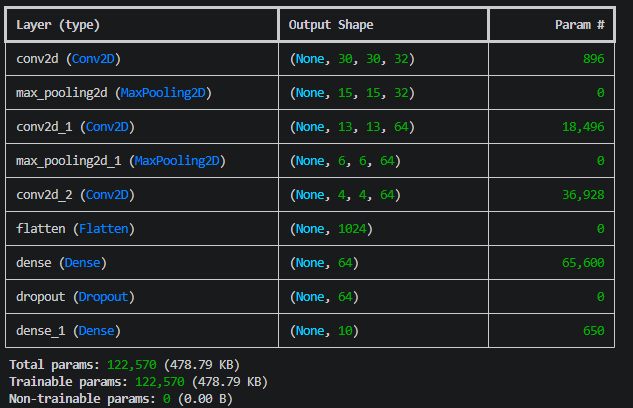
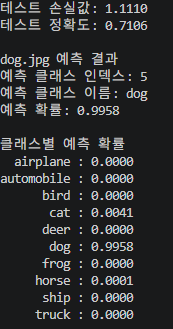

# 컴퓨터 비전
본 저장소는 TensorFlow와 Keras를 이용한 손글씨 숫자 분류 과제를 정리한 페이지입니다.  
본 과제에서는 MNIST 데이터셋을 이용하여 간단한 이미지 분류기를 구현하였다.

---

# 1번 과제: MNIST 기반 간단한 이미지 분류기 구현

## 1. 문제 설명
손글씨 숫자 이미지 데이터셋인 MNIST를 이용하여 간단한 이미지 분류기를 구현하였다.  
MNIST는 28x28 크기의 흑백 손글씨 숫자 이미지로 구성되어 있으며, 각 이미지는 0부터 9까지의 숫자 중 하나의 클래스로 분류된다.  
본 과제에서는 MNIST 데이터를 불러온 뒤, 간단한 완전연결 신경망(MLP)을 구축하고 학습하여 테스트 데이터에 대한 분류 정확도를 평가하였다.

## 2. 요구사항
- MNIST 데이터셋을 로드
- 데이터를 훈련 세트와 테스트 세트로 분할
- 간단한 신경망 모델을 구축
- 모델을 훈련시키고 정확도를 평가

## 3. 사용한 주요 함수

### `mnist.load_data()`
MNIST 데이터셋을 불러오는 함수이다.  
훈련 데이터와 테스트 데이터를 자동으로 나누어 제공한다.

### `Sequential()`
신경망 레이어를 순차적으로 쌓아 모델을 구성하는 함수이다.

### `Flatten()`
2차원 이미지 데이터를 1차원 벡터로 변환하는 레이어이다.  
28x28 이미지를 784차원 벡터로 펼친다.

### `Dense()`
완전연결층(Fully Connected Layer)을 구성하는 레이어이다.  
은닉층과 출력층을 구현하는 데 사용하였다.

### `model.compile()`
손실 함수, 최적화 함수, 평가 지표를 설정하는 함수이다.

### `model.fit()`
훈련 데이터를 사용하여 모델을 학습시키는 함수이다.

### `model.evaluate()`
테스트 데이터를 사용하여 학습된 모델의 성능을 평가하는 함수이다.

## 4. 핵심 코드

### MNIST 데이터셋 로드
~~~python
(x_train, y_train), (x_test, y_test) = mnist.load_data()
~~~

### 데이터 정규화
~~~python
x_train = x_train.astype("float32") / 255.0
x_test = x_test.astype("float32") / 255.0
~~~

### 신경망 모델 구성
~~~python
model = Sequential([
    Flatten(input_shape=(28, 28)),
    Dense(128, activation='relu'),
    Dense(64, activation='relu'),
    Dense(10, activation='softmax')
])
~~~

### 모델 학습
~~~python
model.fit(
    x_train,
    y_train,
    epochs=5,
    batch_size=128,
    validation_split=0.1
)
~~~

### 모델 평가
~~~python
test_loss, test_accuracy = model.evaluate(x_test, y_test, verbose=0)
~~~

## 5. 중간 결과물

### 데이터셋 정보 확인
MNIST 데이터셋을 불러온 뒤, 훈련 이미지 수, 테스트 이미지 수, 이미지 크기를 출력하여 데이터가 정상적으로 로드되었는지 확인하였다.

  

### 모델 구조 확인
`model.summary()`를 사용하여 입력층, 은닉층, 출력층으로 구성된 간단한 분류기 구조를 확인하였다.

  

## 6. 최종 결과물

### 테스트 정확도, 예측 결과
학습이 끝난 뒤 테스트 데이터에 대해 손실값과 정확도를 출력하였다, 테스트 이미지 일부에 대해 예측값과 실제 정답을 비교하여 출력하였다.

  

### 해석
MNIST는 비교적 단순한 손글씨 숫자 데이터셋이므로, 복잡한 CNN이 아니더라도 간단한 완전연결 신경망만으로도 높은 정확도를 얻을 수 있다.  
또한 입력 픽셀 값을 0~1 범위로 정규화하면 학습이 더 안정적으로 진행된다.

## 7. 전체 코드

~~~python
import tensorflow as tf                                      # TensorFlow 라이브러리를 불러옴
from tensorflow.keras.datasets import mnist                  # MNIST 데이터셋을 불러오기 위한 모듈을 가져옴
from tensorflow.keras.models import Sequential               # 순차형 신경망 모델을 만들기 위한 Sequential을 가져옴
from tensorflow.keras.layers import Flatten, Dense           # 입력 펼치기용 Flatten, 완전연결층 Dense를 가져옴

# MNIST 데이터셋을 불러옴
# x_train, y_train은 훈련 데이터
# x_test, y_test는 테스트 데이터
(x_train, y_train), (x_test, y_test) = mnist.load_data()

# 데이터셋의 기본 정보를 출력
print("훈련 이미지 개수:", x_train.shape[0])                  # 훈련 이미지 개수를 출력
print("테스트 이미지 개수:", x_test.shape[0])                  # 테스트 이미지 개수를 출력
print("이미지 크기:", x_train.shape[1:])                       # 각 이미지의 크기(28, 28)를 출력

# 픽셀 값을 0~255 정수 범위에서 0~1 실수 범위로 정규화
# 신경망 학습이 더 안정적으로 진행되도록 하기 위함
x_train = x_train.astype("float32") / 255.0
x_test = x_test.astype("float32") / 255.0

# 간단한 신경망 모델을 생성
model = Sequential([
    Flatten(input_shape=(28, 28)),                           # 28x28 이미지를 1차원 784 벡터로 펼침
    Dense(128, activation='relu'),                           # 은닉층 1: 뉴런 128개, 활성화 함수는 ReLU
    Dense(64, activation='relu'),                            # 은닉층 2: 뉴런 64개, 활성화 함수는 ReLU
    Dense(10, activation='softmax')                          # 출력층: 숫자 0~9 분류를 위해 10개 노드 사용
])

# 모델 학습 방식을 설정
# optimizer='adam'은 가중치 갱신 방법
# loss='sparse_categorical_crossentropy'는 정수형 레이블에 적합한 손실 함수
# metrics=['accuracy']는 정확도를 함께 계산하겠다는 의미
model.compile(
    optimizer='adam',
    loss='sparse_categorical_crossentropy',
    metrics=['accuracy']
)

# 모델 구조를 출력
model.summary()

# 모델을 훈련 데이터로 학습
# epochs=5는 전체 데이터를 5번 반복 학습한다는 의미
# batch_size=128은 한 번에 128장씩 묶어서 학습한다는 의미
# validation_split=0.1은 훈련 데이터의 10%를 검증용으로 사용한다는 의미
model.fit(
    x_train,
    y_train,
    epochs=5,
    batch_size=128,
    validation_split=0.1
)

# 테스트 데이터로 모델 성능을 평가
test_loss, test_accuracy = model.evaluate(x_test, y_test, verbose=0)

# 최종 테스트 손실값과 정확도를 출력
print("테스트 손실값:", test_loss)
print("테스트 정확도:", test_accuracy)

# 테스트 이미지 일부에 대해 예측 수행
predictions = model.predict(x_test[:10])

# 예측 결과와 실제 정답을 비교하여 출력
for i in range(10):
    predicted_label = tf.argmax(predictions[i]).numpy()      # 가장 확률이 높은 클래스를 예측값으로 선택
    true_label = y_test[i]                                   # 실제 정답 레이블을 가져옴
    print(f"{i+1}번째 이미지 -> 예측: {predicted_label}, 실제: {true_label}")
~~~

---

# 정리

1. MNIST 데이터셋 로드  
2. 데이터 정규화 및 간단한 신경망 구성  
3. 모델 학습 및 테스트 정확도 평가  
4. 테스트 이미지 예측 결과 확인

---

# 2번 과제: CIFAR-10 데이터셋을 활용한 CNN 모델 구축

## 1. 문제 설명
CIFAR-10 데이터셋을 이용하여 합성곱신경망(CNN)을 구축하고 이미지 분류를 수행하였다.  
CIFAR-10은 32x32 크기의 컬러 이미지 10개 클래스로 구성된 데이터셋이며, 비행기, 자동차, 새, 고양이, 사슴, 개, 개구리, 말, 배, 트럭의 클래스를 포함한다.  
본 과제에서는 CIFAR-10 데이터를 불러와 정규화한 뒤 CNN 모델을 설계하고 학습하였으며, 테스트 정확도를 평가하고 `dog.jpg`에 대한 예측도 수행하였다.

## 2. 요구사항
- CIFAR-10 데이터셋을 로드
- 데이터 전처리(정규화 등)를 수행
- CNN 모델을 설계하고 훈련
- 모델의 성능을 평가하고, 테스트 이미지(`dog.jpg`)에 대한 예측을 수행

## 3. 사용한 주요 함수

### `cifar10.load_data()`
CIFAR-10 데이터셋을 불러오는 함수이다.  
훈련 데이터와 테스트 데이터를 자동으로 분리하여 제공한다.

### `Conv2D()`
이미지에서 지역적 특징을 추출하는 합성곱 레이어이다.

### `MaxPooling2D()`
특징맵의 크기를 줄여 계산량을 줄이고 중요한 특징을 남기는 풀링 레이어이다.

### `Flatten()`
합성곱 레이어의 출력을 1차원 벡터로 펼치는 레이어이다.

### `Dense()`
완전연결층을 구성하는 레이어이다.  
최종 분류기를 구성하는 데 사용한다.

### `Dropout()`
학습 중 일부 노드를 무작위로 제외하여 과적합을 줄이는 레이어이다.

### `load_img()` / `img_to_array()`
외부 이미지 파일(`dog.jpg`)을 불러와 모델 입력 형태의 배열로 변환하는 함수이다.

## 4. 핵심 코드

### CIFAR-10 데이터셋 로드
~~~python
(x_train, y_train), (x_test, y_test) = cifar10.load_data()
~~~

### 데이터 정규화
~~~python
x_train = x_train.astype("float32") / 255.0
x_test = x_test.astype("float32") / 255.0
~~~

### CNN 모델 구성
~~~python
model = Sequential()
model.add(Conv2D(32, (3, 3), activation='relu', input_shape=(32, 32, 3)))
model.add(MaxPooling2D((2, 2)))
model.add(Conv2D(64, (3, 3), activation='relu'))
model.add(MaxPooling2D((2, 2)))
model.add(Conv2D(64, (3, 3), activation='relu'))
model.add(Flatten())
model.add(Dense(64, activation='relu'))
model.add(Dropout(0.3))
model.add(Dense(10, activation='softmax'))
~~~

### 모델 학습
~~~python
history = model.fit(
    x_train,
    y_train,
    epochs=10,
    batch_size=64,
    validation_split=0.1
)
~~~

### dog.jpg 예측
~~~python
prediction = model.predict(dog_array, verbose=0)
predicted_index = np.argmax(prediction[0])
predicted_label = class_names[predicted_index]
~~~

## 5. 중간 결과물

### 데이터셋 정보 확인
CIFAR-10 데이터셋을 불러온 뒤 데이터의 크기와 구조를 출력하여 정상적으로 로드되었는지 확인하였다.

  

### 모델 구조 확인
`model.summary()`를 통해 합성곱층, 풀링층, 완전연결층으로 구성된 CNN 구조를 확인하였다.

  

## 6. 최종 결과물

### 테스트 정확도, dog.jpg 예측 결과
학습이 끝난 후 테스트 데이터셋에 대해 손실값과 정확도를 출력하였다, 학습된 모델을 이용해 외부 입력 이미지 `dog.jpg`를 예측하였다.

  

### 해석
CNN은 합성곱층을 통해 이미지의 지역적 특징을 효과적으로 추출할 수 있으므로, CIFAR-10 같은 컬러 이미지 분류 문제에 적합하다.  
또한 입력 이미지를 0~1 범위로 정규화하면 학습이 더 안정적으로 진행되며, 외부 이미지에 대해서도 같은 전처리를 적용하면 학습된 모델로 예측이 가능하다.

## 7. 전체 코드

~~~python
import os                                                       # 파일 존재 여부를 확인하기 위해 os를 불러옴
import numpy as np                                              # 배열 연산을 위해 numpy를 np로 불러옴
import tensorflow as tf                                         # TensorFlow 라이브러리를 tf로 불러옴
from tensorflow.keras.datasets import cifar10                   # CIFAR-10 데이터셋 로드를 위해 cifar10 모듈을 불러옴
from tensorflow.keras.models import Sequential                  # 순차형 모델 구성을 위해 Sequential을 불러옴
from tensorflow.keras.layers import Conv2D, MaxPooling2D        # CNN 구성을 위한 Conv2D, MaxPooling2D 레이어를 불러옴
from tensorflow.keras.layers import Flatten, Dense, Dropout     # 분류기를 위한 Flatten, Dense, Dropout 레이어를 불러옴
from tensorflow.keras.utils import load_img, img_to_array       # dog.jpg 로드와 배열 변환을 위해 유틸리티를 불러옴

# CIFAR-10 클래스 이름을 리스트로 정의
class_names = [
    'airplane',                                                 # 클래스 0
    'automobile',                                               # 클래스 1
    'bird',                                                     # 클래스 2
    'cat',                                                      # 클래스 3
    'deer',                                                     # 클래스 4
    'dog',                                                      # 클래스 5
    'frog',                                                     # 클래스 6
    'horse',                                                    # 클래스 7
    'ship',                                                     # 클래스 8
    'truck'                                                     # 클래스 9
]

# CIFAR-10 데이터셋을 로드
# x_train, y_train은 학습 데이터
# x_test, y_test는 테스트 데이터
(x_train, y_train), (x_test, y_test) = cifar10.load_data()

# 데이터셋의 형태를 출력
print("훈련 이미지 shape:", x_train.shape)                      # 예: (50000, 32, 32, 3)
print("훈련 라벨 shape:", y_train.shape)                        # 예: (50000, 1)
print("테스트 이미지 shape:", x_test.shape)                     # 예: (10000, 32, 32, 3)
print("테스트 라벨 shape:", y_test.shape)                       # 예: (10000, 1)

# 픽셀 값을 0~255 범위에서 0~1 범위로 정규화
# CNN 학습 시 수렴을 더 안정적으로 하기 위한 전처리
x_train = x_train.astype("float32") / 255.0
x_test = x_test.astype("float32") / 255.0

# 라벨은 (N, 1) 형태이므로 보기 편하게 1차원으로 바꿔도 되지만
# sparse_categorical_crossentropy는 현재 형태도 처리 가능하므로 그대로 사용 가능
# 여기서는 출력 편의를 위해 1차원으로 변환
y_train = y_train.flatten()
y_test = y_test.flatten()

# CNN 모델을 생성
model = Sequential()

# 첫 번째 합성곱 층을 추가
# 입력 이미지 크기는 32x32, 채널 수는 3(RGB)
# 필터 수는 32개, 커널 크기는 3x3, 활성화 함수는 ReLU
model.add(Conv2D(32, (3, 3), activation='relu', input_shape=(32, 32, 3)))

# 첫 번째 풀링 층을 추가
# 2x2 최대 풀링으로 공간 크기를 줄여 계산량을 감소시킴
model.add(MaxPooling2D((2, 2)))

# 두 번째 합성곱 층을 추가
# 필터 수를 64개로 늘려 더 복잡한 특징을 추출
model.add(Conv2D(64, (3, 3), activation='relu'))

# 두 번째 풀링 층을 추가
model.add(MaxPooling2D((2, 2)))

# 세 번째 합성곱 층을 추가
# 필터 수를 다시 64개로 설정하여 특징을 더 정교하게 추출
model.add(Conv2D(64, (3, 3), activation='relu'))

# 3차원 특징맵을 1차원 벡터로 펼침
model.add(Flatten())

# 완전연결층(Dense)을 추가
# 은닉 노드 수는 64개, 활성화 함수는 ReLU
model.add(Dense(64, activation='relu'))

# 과적합 완화를 위해 Dropout을 추가
# 학습 시 노드의 30%를 무작위로 끔
model.add(Dropout(0.3))

# 출력층을 추가
# CIFAR-10은 10개 클래스를 가지므로 출력 노드 수는 10개
# softmax를 사용하여 각 클래스에 대한 확률을 출력
model.add(Dense(10, activation='softmax'))

# 모델의 학습 설정을 정의
# optimizer='adam'은 가중치 갱신 알고리즘
# loss='sparse_categorical_crossentropy'는 정수형 클래스 라벨에 적합한 손실 함수
# metrics=['accuracy']는 정확도를 함께 계산한다는 의미
model.compile(
    optimizer='adam',
    loss='sparse_categorical_crossentropy',
    metrics=['accuracy']
)

# 모델 구조를 출력
model.summary()

# 모델을 학습
# validation_split=0.1은 훈련 데이터의 10%를 검증용으로 사용
history = model.fit(
    x_train,                                                    # 학습 이미지
    y_train,                                                    # 학습 라벨
    epochs=10,                                                  # 전체 데이터를 10번 반복 학습
    batch_size=64,                                              # 한 번에 64장씩 학습
    validation_split=0.1                                        # 검증용 데이터 비율
)

# 테스트 데이터로 모델 성능을 평가
test_loss, test_accuracy = model.evaluate(x_test, y_test, verbose=0)

# 테스트 손실값과 정확도를 출력
print(f"테스트 손실값: {test_loss:.4f}")
print(f"테스트 정확도: {test_accuracy:.4f}")

# dog.jpg 파일이 존재하는지 확인
if os.path.exists("dog.jpg"):
    # dog.jpg 파일을 32x32 크기로 불러옴
    # CIFAR-10 입력 크기에 맞추기 위해 target_size를 (32, 32)로 설정
    dog_image = load_img("dog.jpg", target_size=(32, 32))

    # PIL 이미지를 NumPy 배열로 변환
    dog_array = img_to_array(dog_image)

    # 픽셀 값을 0~1 범위로 정규화
    dog_array = dog_array.astype("float32") / 255.0

    # 모델 입력 형태에 맞게 배치 차원(1장)을 추가
    dog_array = np.expand_dims(dog_array, axis=0)

    # dog.jpg에 대한 클래스 확률을 예측
    prediction = model.predict(dog_array, verbose=0)

    # 가장 확률이 높은 클래스 인덱스를 구함
    predicted_index = np.argmax(prediction[0])

    # 예측된 클래스 이름을 구함
    predicted_label = class_names[predicted_index]

    # 예측 확률을 구함
    predicted_prob = prediction[0][predicted_index]

    # 예측 결과를 출력
    print("\ndog.jpg 예측 결과")
    print("예측 클래스 인덱스:", predicted_index)
    print("예측 클래스 이름:", predicted_label)
    print(f"예측 확률: {predicted_prob:.4f}")

    # 전체 클래스별 확률도 함께 출력
    print("\n클래스별 예측 확률")
    for i, prob in enumerate(prediction[0]):
        print(f"{class_names[i]:>10s} : {prob:.4f}")
else:
    # dog.jpg가 현재 폴더에 없으면 안내 메시지를 출력
    print("\ndog.jpg 파일이 현재 작업 폴더에 없습니다.")
    print("같은 폴더에 dog.jpg를 넣고 다시 실행하면 예측 결과를 확인할 수 있습니다.")
~~~

---

# 정리

1. CIFAR-10 데이터셋 로드  
2. 픽셀값 정규화 등 전처리 수행  
3. CNN 모델 설계 및 학습  
4. 테스트 정확도 평가  
5. dog.jpg에 대한 클래스 예측 수행
