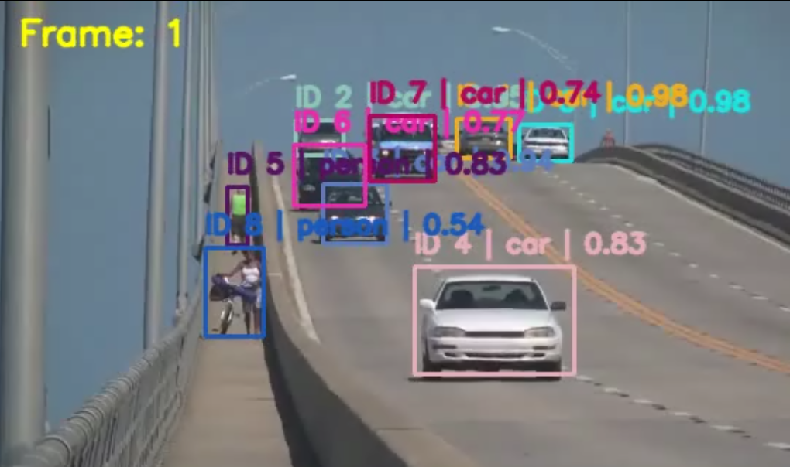
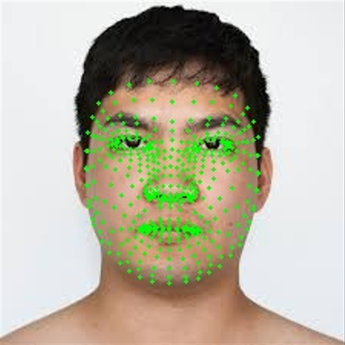

# 컴퓨터 비전

1. SORT 알고리즘을 활용한 다중 객체 추적기 구현  
2. MediaPipe를 활용한 얼굴 랜드마크 추출 및 시각화  

각 과제마다 문제 설명, 핵심 코드, 결과 해석, 전체 코드를 함께 정리하였습니다.

---

# 1번 과제: SORT 알고리즘을 활용한 다중 객체 추적기 구현

## 1. 문제 설명
본 실습에서는 SORT(Simple Online and Realtime Tracking) 알고리즘을 사용하여 비디오에서 다중 객체를 실시간으로 추적하는 프로그램을 구현하였다.  
객체 검출은 YOLOv3를 사용하여 수행하고, 검출된 경계상자를 SORT 추적기에 입력하여 프레임 간 동일한 객체에 고유 ID를 부여하였다.  
이를 통해 다중 객체 추적의 기본 개념과 SORT 알고리즘의 적용 방법을 학습할 수 있다.

## 2. 요구사항
- 객체 검출기 구현: YOLOv3와 같은 사전훈련된 객체 검출 모델을 사용하여 각 프레임에서 객체를 검출
- SORT 추적기 초기화: 검출된 객체의 경계상자를 입력으로 받아 SORT 추적기를 초기화
- 객체 추적: 각 프레임마다 검출된 객체와 기존 추적 객체를 연관시켜 추적을 유지
- 결과 시각화: 추적된 각 객체에 고유 ID를 부여하고, 해당 ID와 경계상자를 비디오 프레임에 표시하여 실시간으로 출력

## 3. 개념 설명

### 3.1 YOLOv3
YOLOv3는 이미지나 영상에서 객체를 빠르게 검출할 수 있는 실시간 객체 검출 모델이다.  
본 실습에서는 OpenCV DNN 모듈을 이용하여 YOLOv3 모델을 불러오고, 각 프레임에서 객체의 bounding box와 confidence score를 얻는다.

### 3.2 SORT
SORT는 다중 객체 추적 알고리즘으로, 다음 두 가지 핵심 요소를 사용한다.

- 칼만 필터(Kalman Filter): 이전 상태를 기반으로 다음 프레임의 객체 위치를 예측
- 헝가리안 알고리즘(Hungarian Algorithm): 검출된 객체와 기존 추적 객체를 최적으로 연관

즉, SORT는 프레임마다 새로 검출된 객체들을 기존 트랙과 연결하여 같은 객체인지 판단하고, 같은 객체로 판단되면 동일한 ID를 유지한다.

### 3.3 IoU
IoU(Intersection over Union)는 두 bounding box가 얼마나 겹치는지를 나타내는 지표이다.  
SORT에서는 보통 IoU를 기준으로 검출 결과와 기존 트랙을 연결한다.

---

## 4. 사용한 주요 함수

### `cv.dnn.readNetFromDarknet()`
YOLOv3의 `.cfg`와 `.weights` 파일을 불러와 네트워크를 생성하는 함수이다.

### `cv.dnn.blobFromImage()`
YOLO 입력 형식에 맞게 프레임을 blob 형태로 전처리하는 함수이다.

### `cv.dnn.NMSBoxes()`
중복된 객체 검출 박스를 제거하기 위해 Non-Maximum Suppression을 수행하는 함수이다.

### `linear_sum_assignment()`
헝가리안 알고리즘을 수행하여 검출 객체와 추적 객체를 최적으로 매칭하는 함수이다.

### `cv.KalmanFilter()`
칼만 필터를 생성하여 객체의 다음 위치를 예측하는 데 사용하는 클래스이다.

### `cv.rectangle()`
객체 bounding box를 영상 위에 그리는 함수이다.

### `cv.putText()`
객체 ID와 클래스 이름을 영상 위에 표시하는 함수이다.

---

## 5. 핵심 코드

### YOLOv3 로드
~~~python
net = cv.dnn.readNetFromDarknet(cfg_path, weights_path)
~~~

### blob 생성 및 객체 검출
~~~python
blob = cv.dnn.blobFromImage(
    frame,
    scalefactor=1 / 255.0,
    size=(416, 416),
    mean=(0, 0, 0),
    swapRB=True,
    crop=False
)
net.setInput(blob)
outputs = net.forward(output_layer_names)
~~~

### SORT 매칭
~~~python
matched, unmatched_dets, unmatched_trks = associate_detections_to_trackers(
    detections,
    trackers,
    iou_threshold=IOU_THRESHOLD
)
~~~

### 결과 시각화
~~~python
cv.rectangle(frame, (x1, y1), (x2, y2), color, 2)
cv.putText(frame, label, (x1, max(20, y1 - 10)),
           cv.FONT_HERSHEY_SIMPLEX, 0.6, color, 2, cv.LINE_AA)
~~~

---

## 6. 결과물

### 추적 결과
YOLOv3로 검출된 객체에 대해 SORT가 각 객체의 이동을 추적하고, 프레임마다 동일한 객체에 같은 ID를 부여하여 출력하였다.

  

### 해석
비디오의 각 프레임에서 YOLOv3가 객체를 검출하고, SORT가 기존 트랙과의 IoU를 기반으로 같은 객체를 연결하였다.  
그 결과 이동하는 차량이나 사람 등 여러 객체에 대해 고유 ID를 유지하며 추적할 수 있었다.  
이를 통해 다중 객체 추적의 기본 구조인 검출 + 예측 + 데이터 연관 과정을 확인할 수 있었다.

---

## 7. 실행 전 준비 파일

다음 파일들을 같은 폴더에 준비한다.

- `slow_traffic_small.mp4`
- `yolov3.cfg`
- `yolov3.weights`

`coco.names` 파일 없이도 동작하도록 COCO 클래스 이름을 코드 내부에 직접 작성하였다.

---

## 8. 전체 코드

~~~python
import os
import cv2 as cv
import numpy as np
from scipy.optimize import linear_sum_assignment

# =========================
# 사용자 설정
# =========================
VIDEO_PATH = "slow_traffic_small.mp4"         # 입력 비디오 파일 경로
YOLO_CFG = "yolov3.cfg"                       # YOLOv3 cfg 파일 경로
YOLO_WEIGHTS = "yolov3.weights"               # YOLOv3 weights 파일 경로
OUTPUT_PATH = "tracked_slow_traffic.mp4"      # 결과 비디오 저장 경로

CONF_THRESHOLD = 0.5                          # 객체 검출 confidence 임계값
NMS_THRESHOLD = 0.4                           # NMS 임계값
IOU_THRESHOLD = 0.3                           # SORT 매칭용 IoU 임계값
MAX_AGE = 10                                  # 몇 프레임까지 미검출 상태를 허용할지
MIN_HITS = 3                                  # 최소 몇 번 매칭되어야 안정된 트랙으로 출력할지
TRACK_ONLY = {"person", "bicycle", "car", "motorbike", "bus", "truck"}  # 추적할 클래스 집합

# COCO 클래스 이름을 코드 안에 직접 정의
CLASS_NAMES = [
    "person", "bicycle", "car", "motorbike", "aeroplane",
    "bus", "train", "truck", "boat", "traffic light",
    "fire hydrant", "stop sign", "parking meter", "bench", "bird",
    "cat", "dog", "horse", "sheep", "cow",
    "elephant", "bear", "zebra", "giraffe", "backpack",
    "umbrella", "handbag", "tie", "suitcase", "frisbee",
    "skis", "snowboard", "sports ball", "kite", "baseball bat",
    "baseball glove", "skateboard", "surfboard", "tennis racket", "bottle",
    "wine glass", "cup", "fork", "knife", "spoon",
    "bowl", "banana", "apple", "sandwich", "orange",
    "broccoli", "carrot", "hot dog", "pizza", "donut",
    "cake", "chair", "sofa", "pottedplant", "bed",
    "diningtable", "toilet", "tvmonitor", "laptop", "mouse",
    "remote", "keyboard", "cell phone", "microwave", "oven",
    "toaster", "sink", "refrigerator", "book", "clock",
    "vase", "scissors", "teddy bear", "hair drier", "toothbrush"
]

# =========================
# IoU 계산 함수
# =========================
def iou_xyxy(box_a, box_b):
    x1 = max(box_a[0], box_b[0])                           # 교집합 좌상단 x 좌표
    y1 = max(box_a[1], box_b[1])                           # 교집합 좌상단 y 좌표
    x2 = min(box_a[2], box_b[2])                           # 교집합 우하단 x 좌표
    y2 = min(box_a[3], box_b[3])                           # 교집합 우하단 y 좌표

    inter_w = max(0.0, x2 - x1)                            # 교집합 너비
    inter_h = max(0.0, y2 - y1)                            # 교집합 높이
    inter_area = inter_w * inter_h                         # 교집합 면적

    area_a = max(0.0, box_a[2] - box_a[0]) * max(0.0, box_a[3] - box_a[1])   # 박스 A 면적
    area_b = max(0.0, box_b[2] - box_b[0]) * max(0.0, box_b[3] - box_b[1])   # 박스 B 면적

    union = area_a + area_b - inter_area                   # 합집합 면적
    if union <= 0:
        return 0.0                                         # 예외 상황이면 IoU 0 반환
    return inter_area / union                              # IoU 계산 결과 반환

# =========================
# bbox <-> Kalman state 변환
# state = [cx, cy, s, r, vx, vy, vs]
# cx, cy : 중심 좌표
# s      : 박스 면적
# r      : 종횡비(width / height)
# =========================
def bbox_to_z(bbox):
    x1, y1, x2, y2 = bbox                                  # bounding box 좌표를 분해
    w = max(1.0, x2 - x1)                                  # 너비 계산
    h = max(1.0, y2 - y1)                                  # 높이 계산
    cx = x1 + w / 2.0                                      # 중심 x 좌표 계산
    cy = y1 + h / 2.0                                      # 중심 y 좌표 계산
    s = w * h                                              # 면적 계산
    r = w / h                                              # 종횡비 계산
    return np.array([[cx], [cy], [s], [r]], dtype=np.float32)  # 칼만 필터 측정 벡터 형태로 반환

def x_to_bbox(state):
    state = np.asarray(state).reshape(-1)                  # 어떤 형태로 들어와도 1차원으로 펴서 안전하게 처리

    cx = float(state[0])                                   # 중심 x 좌표 추출
    cy = float(state[1])                                   # 중심 y 좌표 추출
    s = float(state[2])                                    # 면적 추출
    r = float(state[3])                                    # 종횡비 추출

    if s <= 0 or r <= 0:
        return np.array([0, 0, 0, 0], dtype=np.float32)    # 잘못된 값이면 빈 박스 반환

    w = np.sqrt(s * r)                                     # 면적과 종횡비로 width 복원
    h = s / w                                              # height 복원

    x1 = cx - w / 2.0                                      # 좌상단 x 좌표 계산
    y1 = cy - h / 2.0                                      # 좌상단 y 좌표 계산
    x2 = cx + w / 2.0                                      # 우하단 x 좌표 계산
    y2 = cy + h / 2.0                                      # 우하단 y 좌표 계산

    return np.array([x1, y1, x2, y2], dtype=np.float32)    # 박스 좌표 반환

# =========================
# SORT용 칼만 필터 트래커 클래스
# =========================
class KalmanBoxTracker:
    count = 0                                              # 전역 트랙 ID 카운터

    def __init__(self, bbox, class_id, score):
        self.kf = cv.KalmanFilter(7, 4)                    # 상태 7차원, 측정 4차원 칼만 필터 생성

        self.kf.transitionMatrix = np.array([
            [1, 0, 0, 0, 1, 0, 0],
            [0, 1, 0, 0, 0, 1, 0],
            [0, 0, 1, 0, 0, 0, 1],
            [0, 0, 0, 1, 0, 0, 0],
            [0, 0, 0, 0, 1, 0, 0],
            [0, 0, 0, 0, 0, 1, 0],
            [0, 0, 0, 0, 0, 0, 1],
        ], dtype=np.float32)                               # 상태 전이 행렬 설정

        self.kf.measurementMatrix = np.array([
            [1, 0, 0, 0, 0, 0, 0],
            [0, 1, 0, 0, 0, 0, 0],
            [0, 0, 1, 0, 0, 0, 0],
            [0, 0, 0, 1, 0, 0, 0],
        ], dtype=np.float32)                               # 측정 행렬 설정

        self.kf.processNoiseCov = np.eye(7, dtype=np.float32) * 1e-2     # 프로세스 노이즈 공분산
        self.kf.measurementNoiseCov = np.eye(4, dtype=np.float32) * 1e-1 # 측정 노이즈 공분산
        self.kf.errorCovPost = np.eye(7, dtype=np.float32)                # 초기 오차 공분산
        self.kf.statePost = np.zeros((7, 1), dtype=np.float32)            # 초기 상태 벡터 생성
        self.kf.statePost[:4] = bbox_to_z(bbox)                           # 초기 bounding box를 상태벡터에 반영

        self.time_since_update = 0                         # 마지막 업데이트 이후 경과 프레임 수
        self.id = KalmanBoxTracker.count                   # 현재 트랙 ID 할당
        KalmanBoxTracker.count += 1                        # 다음 ID를 위해 카운터 증가
        self.hits = 1                                      # 매칭된 횟수
        self.hit_streak = 1                                # 연속 매칭 횟수
        self.age = 0                                       # 트랙 생성 후 총 경과 프레임 수
        self.class_id = int(class_id)                      # 객체 클래스 ID 저장
        self.score = float(score)                          # confidence score 저장

    def predict(self):
        if self.kf.statePost[2, 0] + self.kf.statePost[6, 0] <= 0:
            self.kf.statePost[6, 0] = 0.0                  # 면적이 음수가 되지 않도록 보정

        predicted = self.kf.predict()                      # 다음 상태 예측
        self.age += 1                                      # 트랙 나이 증가

        if self.time_since_update > 0:
            self.hit_streak = 0                            # 업데이트가 끊기면 연속 hit 초기화

        self.time_since_update += 1                        # 마지막 업데이트 이후 프레임 수 증가
        return x_to_bbox(predicted[:4])                    # 예측된 bounding box 반환

    def update(self, bbox, class_id, score):
        measurement = bbox_to_z(bbox)                      # 측정값으로 변환
        self.kf.correct(measurement)                       # 칼만 필터 보정
        self.time_since_update = 0                         # 방금 업데이트했으므로 0으로 초기화
        self.hits += 1                                     # 총 hit 증가
        self.hit_streak += 1                               # 연속 hit 증가
        self.class_id = int(class_id)                      # 클래스 ID 갱신
        self.score = float(score)                          # score 갱신

    def get_state(self):
        return x_to_bbox(self.kf.statePost[:4])            # 현재 상태를 bounding box로 변환하여 반환

# =========================
# 검출과 트랙을 IoU 기반으로 매칭
# Hungarian algorithm 사용
# =========================
def associate_detections_to_trackers(detections, trackers, iou_threshold=0.3):
    if len(trackers) == 0:
        return np.empty((0, 2), dtype=int), np.arange(len(detections)), np.empty((0,), dtype=int)  # 트랙이 없으면 모든 검출이 unmatched

    if len(detections) == 0:
        return np.empty((0, 2), dtype=int), np.empty((0,), dtype=int), np.arange(len(trackers))     # 검출이 없으면 모든 트랙이 unmatched

    iou_matrix = np.zeros((len(detections), len(trackers)), dtype=np.float32)  # IoU 행렬 초기화

    for d, det in enumerate(detections):
        det_box = det[:4]                                   # 검출 박스 좌표
        det_cls = int(det[5])                               # 검출 클래스 ID
        for t, trk in enumerate(trackers):
            trk_box = trk.get_state()                       # 트랙의 현재 예측 박스
            trk_cls = trk.class_id                          # 트랙 클래스 ID

            if det_cls != trk_cls:
                iou_matrix[d, t] = 0.0                      # 클래스가 다르면 매칭하지 않음
            else:
                iou_matrix[d, t] = iou_xyxy(det_box, trk_box)  # 같은 클래스면 IoU 계산

    row_ind, col_ind = linear_sum_assignment(-iou_matrix)   # IoU 최대화 문제를 Hungarian으로 해결

    matched_indices = []                                    # 매칭된 인덱스 저장 리스트
    unmatched_detections = []                               # 매칭되지 않은 검출 저장 리스트
    unmatched_trackers = []                                 # 매칭되지 않은 트랙 저장 리스트

    assigned_det = set()                                    # 매칭된 검출 집합
    assigned_trk = set()                                    # 매칭된 트랙 집합

    for r, c in zip(row_ind, col_ind):
        if iou_matrix[r, c] >= iou_threshold:
            matched_indices.append([r, c])                  # IoU 임계값 이상만 매칭 확정
            assigned_det.add(r)                             # 검출 인덱스 기록
            assigned_trk.add(c)                             # 트랙 인덱스 기록

    for d in range(len(detections)):
        if d not in assigned_det:
            unmatched_detections.append(d)                  # 매칭되지 않은 검출 추가

    for t in range(len(trackers)):
        if t not in assigned_trk:
            unmatched_trackers.append(t)                    # 매칭되지 않은 트랙 추가

    if len(matched_indices) == 0:
        matched_indices = np.empty((0, 2), dtype=int)       # 매칭이 없으면 빈 배열 반환
    else:
        matched_indices = np.array(matched_indices, dtype=int)  # 매칭 결과를 배열로 변환

    return matched_indices, np.array(unmatched_detections, dtype=int), np.array(unmatched_trackers, dtype=int)

# =========================
# YOLOv3 로드
# =========================
def load_yolo(cfg_path, weights_path):
    if not os.path.exists(cfg_path):
        raise FileNotFoundError(f"YOLO cfg 파일이 없습니다: {cfg_path}")       # cfg 파일 존재 여부 확인
    if not os.path.exists(weights_path):
        raise FileNotFoundError(f"YOLO weights 파일이 없습니다: {weights_path}") # weights 파일 존재 여부 확인

    net = cv.dnn.readNetFromDarknet(cfg_path, weights_path)  # YOLO 네트워크 로드
    net.setPreferableBackend(cv.dnn.DNN_BACKEND_OPENCV)      # OpenCV 백엔드 사용
    net.setPreferableTarget(cv.dnn.DNN_TARGET_CPU)           # CPU 타깃 사용

    layer_names = net.getLayerNames()                        # 모든 레이어 이름 읽기
    output_layer_names = [layer_names[i - 1] for i in net.getUnconnectedOutLayers().flatten()]  # 출력 레이어 이름 추출

    return net, output_layer_names                           # 네트워크와 출력 레이어 반환

# =========================
# YOLOv3로 프레임 내 객체 검출
# 반환: [x1, y1, x2, y2, score, class_id]
# =========================
def detect_objects(frame, net, output_layer_names,
                   conf_threshold=0.5, nms_threshold=0.4, track_only=None):
    h, w = frame.shape[:2]                                   # 현재 프레임 높이와 너비 추출

    blob = cv.dnn.blobFromImage(
        frame,
        scalefactor=1 / 255.0,
        size=(416, 416),
        mean=(0, 0, 0),
        swapRB=True,
        crop=False
    )                                                        # YOLO 입력용 blob 생성

    net.setInput(blob)                                       # 네트워크 입력으로 blob 설정
    outputs = net.forward(output_layer_names)                # 출력 레이어 결과 계산

    boxes = []                                               # 후보 bounding box 리스트
    confidences = []                                         # confidence 저장 리스트
    class_ids = []                                           # class id 저장 리스트

    for output in outputs:
        for detection in output:
            scores = detection[5:]                           # 클래스별 confidence 점수
            class_id = int(np.argmax(scores))                # 가장 높은 점수의 클래스 선택
            confidence = float(scores[class_id])             # 해당 클래스 confidence 추출

            if confidence < conf_threshold:
                continue                                     # confidence가 낮으면 무시

            class_name = CLASS_NAMES[class_id]               # 클래스 이름 확인
            if track_only is not None and class_name not in track_only:
                continue                                     # 추적 대상 클래스가 아니면 무시

            center_x = int(detection[0] * w)                 # 중심 x 좌표를 픽셀 단위로 변환
            center_y = int(detection[1] * h)                 # 중심 y 좌표를 픽셀 단위로 변환
            bw = int(detection[2] * w)                       # 박스 너비를 픽셀 단위로 변환
            bh = int(detection[3] * h)                       # 박스 높이를 픽셀 단위로 변환

            x = int(center_x - bw / 2)                       # 좌상단 x 좌표 계산
            y = int(center_y - bh / 2)                       # 좌상단 y 좌표 계산

            boxes.append([x, y, bw, bh])                     # 박스 저장
            confidences.append(confidence)                   # confidence 저장
            class_ids.append(class_id)                       # class id 저장

    indices = cv.dnn.NMSBoxes(boxes, confidences, conf_threshold, nms_threshold)  # NMS 수행

    detections = []                                          # 최종 검출 리스트
    if len(indices) > 0:
        for i in indices.flatten():
            x, y, bw, bh = boxes[i]                          # NMS 통과 박스 좌표 추출
            x1 = max(0, x)                                   # 이미지 범위를 벗어나지 않도록 보정
            y1 = max(0, y)                                   # 이미지 범위를 벗어나지 않도록 보정
            x2 = min(w - 1, x + bw)                          # 우하단 x 좌표 보정
            y2 = min(h - 1, y + bh)                          # 우하단 y 좌표 보정
            detections.append([x1, y1, x2, y2, confidences[i], class_ids[i]])  # 최종 검출 저장

    if len(detections) == 0:
        return np.empty((0, 6), dtype=np.float32)            # 검출이 없으면 빈 배열 반환

    return np.array(detections, dtype=np.float32)            # 검출 결과를 배열로 반환

# =========================
# ID별 색상 생성
# =========================
def color_for_id(track_id):
    np.random.seed(track_id + 12345)                         # 같은 ID는 같은 색이 나오도록 seed 고정
    color = np.random.randint(0, 255, size=3)               # 무작위 RGB 색 생성
    return int(color[0]), int(color[1]), int(color[2])      # 정수형 BGR 색 반환

# =========================
# 메인 실행 함수
# =========================
def main():
    net, output_layer_names = load_yolo(YOLO_CFG, YOLO_WEIGHTS)  # YOLOv3 모델 로드

    cap = cv.VideoCapture(VIDEO_PATH)                        # 입력 비디오 열기
    if not cap.isOpened():
        raise RuntimeError(f"비디오를 열 수 없습니다: {VIDEO_PATH}")  # 비디오가 열리지 않으면 예외 발생

    width = int(cap.get(cv.CAP_PROP_FRAME_WIDTH))            # 비디오 폭 읽기
    height = int(cap.get(cv.CAP_PROP_FRAME_HEIGHT))          # 비디오 높이 읽기
    fps = cap.get(cv.CAP_PROP_FPS)                           # 비디오 FPS 읽기
    if fps <= 0:
        fps = 30.0                                           # FPS를 읽지 못하면 기본값 30 사용

    fourcc = cv.VideoWriter_fourcc(*"mp4v")                  # mp4v 코덱 지정
    writer = cv.VideoWriter(OUTPUT_PATH, fourcc, fps, (width, height))  # 결과 저장용 VideoWriter 생성

    trackers = []                                            # 현재 활성 트랙 리스트
    frame_count = 0                                          # 프레임 카운터

    while True:
        ret, frame = cap.read()                              # 비디오에서 프레임 한 장 읽기
        if not ret:
            break                                            # 더 이상 프레임이 없으면 종료

        frame_count += 1                                     # 프레임 번호 증가

        detections = detect_objects(
            frame,
            net,
            output_layer_names,
            conf_threshold=CONF_THRESHOLD,
            nms_threshold=NMS_THRESHOLD,
            track_only=TRACK_ONLY
        )                                                    # 현재 프레임에서 객체 검출

        active_trackers = []                                 # 살아남은 트랙 임시 리스트
        for trk in trackers:
            predicted_box = trk.predict()                    # 각 트랙의 현재 위치 예측
            if not np.any(np.isnan(predicted_box)):
                active_trackers.append(trk)                  # 정상 예측이면 유지
        trackers = active_trackers                           # 활성 트랙 갱신

        matched, unmatched_dets, unmatched_trks = associate_detections_to_trackers(
            detections,
            trackers,
            iou_threshold=IOU_THRESHOLD
        )                                                    # 검출과 트랙을 IoU 기반으로 매칭

        for det_idx, trk_idx in matched:
            det = detections[det_idx]                        # 매칭된 검출 정보 가져오기
            bbox = det[:4]                                   # bounding box 추출
            score = det[4]                                   # confidence 추출
            class_id = int(det[5])                           # class id 추출
            trackers[trk_idx].update(bbox, class_id, score) # 트랙을 현재 검출로 업데이트

        for det_idx in unmatched_dets:
            det = detections[det_idx]                        # 새 검출 정보 가져오기
            bbox = det[:4]                                   # bounding box 추출
            score = det[4]                                   # confidence 추출
            class_id = int(det[5])                           # class id 추출
            trackers.append(KalmanBoxTracker(bbox, class_id, score))  # 새로운 트랙 생성

        survived_trackers = []                               # 최종 유지할 트랙 리스트
        for trk in trackers:
            if trk.time_since_update <= MAX_AGE:
                survived_trackers.append(trk)                # 너무 오래 끊기지 않은 트랙만 유지

            should_draw = (trk.time_since_update == 0) and (
                trk.hits >= MIN_HITS or frame_count <= MIN_HITS
            )                                                # 화면에 그릴지 여부 판단

            if should_draw:
                x1, y1, x2, y2 = trk.get_state().astype(int) # 현재 트랙 bounding box 정수형으로 변환
                x1 = max(0, x1)                              # 좌표 보정
                y1 = max(0, y1)                              # 좌표 보정
                x2 = min(width - 1, x2)                      # 좌표 보정
                y2 = min(height - 1, y2)                     # 좌표 보정

                color = color_for_id(trk.id)                 # 트랙 ID별 고유 색 생성
                class_name = CLASS_NAMES[trk.class_id]       # 클래스 이름 가져오기
                label = f"ID {trk.id} | {class_name} | {trk.score:.2f}"  # 표시할 문자열 생성

                cv.rectangle(frame, (x1, y1), (x2, y2), color, 2)  # bounding box 그리기
                cv.putText(
                    frame,
                    label,
                    (x1, max(20, y1 - 10)),
                    cv.FONT_HERSHEY_SIMPLEX,
                    0.6,
                    color,
                    2,
                    cv.LINE_AA
                )                                            # ID와 클래스명 출력

        trackers = survived_trackers                         # 최종 트랙 갱신

        cv.putText(
            frame,
            f"Frame: {frame_count}",
            (20, 30),
            cv.FONT_HERSHEY_SIMPLEX,
            0.8,
            (0, 255, 255),
            2,
            cv.LINE_AA
        )                                                    # 프레임 번호 출력

        cv.imshow("YOLOv3 + SORT Multi-Object Tracking", frame)  # 화면에 결과 프레임 표시
        writer.write(frame)                                  # 결과 비디오에 저장

        key = cv.waitKey(1) & 0xFF                           # 키 입력 대기
        if key == ord('q'):
            break                                            # q 키를 누르면 종료

    cap.release()                                            # 비디오 입력 장치 해제
    writer.release()                                         # 비디오 저장 장치 해제
    cv.destroyAllWindows()                                   # 모든 OpenCV 창 닫기
    print(f"추적 결과 저장 완료: {OUTPUT_PATH}")             # 저장 완료 메시지 출력

if __name__ == "__main__":
    main()                                                   # 메인 함수 실행
~~~

---

# 2번 과제: MediaPipe를 활용한 얼굴 랜드마크 추출 및 시각화

## 1. 문제 설명
본 실습에서는 MediaPipe의 FaceMesh 모듈을 사용하여 얼굴의 랜드마크를 검출하고, 이를 이미지 또는 실시간 영상 위에 시각화하는 프로그램을 구현하였다.  
FaceMesh는 얼굴의 주요 지점을 정밀하게 추출할 수 있는 모델로, 얼굴의 형태를 분석하거나 시각화하는 다양한 응용에 활용될 수 있다.

## 2. 요구사항
- MediaPipe의 FaceMesh 모듈을 사용하여 얼굴 랜드마크 검출기를 초기화
- OpenCV를 사용하여 웹캠으로부터 실시간 영상을 캡처
- 검출된 얼굴 랜드마크를 실시간 영상에 점으로 표시
- ESC 키를 누르면 프로그램이 종료되도록 설정

## 3. 개념 설명

### 3.1 FaceMesh
FaceMesh는 MediaPipe에서 제공하는 얼굴 랜드마크 검출 모듈이다.  
입력된 얼굴 이미지에서 얼굴의 주요 지점을 검출할 수 있으며, 각 랜드마크는 정규화된 좌표값 `(x, y, z)` 형태로 반환된다.

### 3.2 정규화 좌표
FaceMesh가 반환하는 랜드마크 좌표는 이미지 픽셀 좌표가 아니라 0~1 범위의 정규화 좌표이다.  
따라서 실제 이미지 위에 점을 그리기 위해서는 다음과 같이 변환해야 한다.

- `x_pixel = landmark.x * 이미지너비`
- `y_pixel = landmark.y * 이미지높이`

### 3.3 OpenCV circle 함수
검출된 랜드마크를 시각화하기 위해 `cv.circle()` 함수를 사용한다.  
각 랜드마크 좌표에 대해 작은 원을 그리면 얼굴의 전체 메시 구조를 확인할 수 있다.

---

## 4. 사용한 주요 함수

### `cv.imread()`
이미지 파일을 읽어오는 함수이다.

### `cv.VideoCapture()`
웹캠 또는 비디오 장치로부터 실시간 영상을 입력받는 함수이다.

### `mp.solutions.face_mesh.FaceMesh()`
FaceMesh 검출기를 생성하는 함수이다.

### `face_mesh.process()`
입력된 RGB 이미지에서 얼굴 랜드마크를 검출하는 함수이다.

### `cv.circle()`
이미지 위에 점 또는 원을 그리는 함수이다.

### `cv.imshow()`
결과 영상을 화면에 출력하는 함수이다.

---

## 5. 사진에서 얼굴 랜드마크 검출

### 5.1 문제 설명
한 장의 얼굴 사진을 입력으로 사용하여 FaceMesh로 랜드마크를 검출하고, 각 랜드마크를 점으로 시각화한다.

### 5.2 요구사항
- `cv.imread()`로 이미지를 불러온다.
- `FaceMesh`를 사용하여 얼굴 랜드마크를 검출한다.
- 검출된 랜드마크를 `cv.circle()`로 시각화한다.
- 결과 이미지를 저장하고 화면에 출력한다.

### 5.3 전체 코드
~~~python
import cv2 as cv                                              # OpenCV를 불러옴
import mediapipe as mp                                        # MediaPipe를 불러옴

# MediaPipe FaceMesh 모듈을 가져옴
mp_face_mesh = mp.solutions.face_mesh

# 확인할 사진 파일을 읽어옴
img = cv.imread("face.jpg")

# 이미지가 정상적으로 읽혔는지 확인
if img is None:
    print("이미지를 불러올 수 없습니다.")
    exit()

# 원본 이미지를 복사해서 결과를 그릴 이미지로 사용
output = img.copy()

# 이미지 크기를 구함
h, w, _ = img.shape

# OpenCV는 BGR 형식이므로 MediaPipe 입력용 RGB로 변환
rgb = cv.cvtColor(img, cv.COLOR_BGR2RGB)

# 정적 이미지용 FaceMesh 객체 생성
with mp_face_mesh.FaceMesh(
    static_image_mode=True,
    max_num_faces=1,
    refine_landmarks=False,
    min_detection_confidence=0.5
) as face_mesh:

    # 사진 1장을 넣어서 얼굴 랜드마크를 검출
    results = face_mesh.process(rgb)

    # 얼굴 랜드마크가 검출되었는지 확인
    if results.multi_face_landmarks:
        # 검출된 얼굴마다 반복
        for face_landmarks in results.multi_face_landmarks:
            # 검출된 모든 랜드마크에 대해 반복
            for landmark in face_landmarks.landmark:
                # 정규화 좌표를 실제 픽셀 좌표로 변환
                x = int(landmark.x * w)
                y = int(landmark.y * h)

                # 랜드마크를 초록색 점으로 그림
                cv.circle(output, (x, y), 1, (0, 255, 0), -1)

        print("얼굴 랜드마크 검출 완료")
    else:
        print("얼굴을 찾지 못했습니다.")

# 결과 이미지를 저장
cv.imwrite("face_landmarks_result.jpg", output)

# 결과 이미지를 화면에 표시
cv.imshow("Face Landmarks", output)

# 아무 키나 누를 때까지 대기
cv.waitKey(0)

# 모든 창 닫기
cv.destroyAllWindows()
~~~

### 5.4 결과 해석

  

입력 이미지에서 얼굴이 정상적으로 검출되면 얼굴 위에 다수의 랜드마크 점이 표시된다.  
이 점들은 얼굴 윤곽선, 눈, 코, 입, 볼, 턱선 등 얼굴의 세부 구조를 나타낸다.

---

## 6. 실행 방법

### 6.1 SORT 실행에 필요한 라이브러리 설치
~~~bash
pip install opencv-python scipy numpy
~~~

### 6.2 SORT 코드 실행
~~~bash
python landmark.py
~~~

### 6.3 MediaPipe 실행에 필요한 라이브러리 설치
~~~bash
pip install mediapipe opencv-python
~~~

### 6.4 사진 기반 FaceMesh 실행
~~~bash
python landmark_image.py
~~~

---

## 7. 주의사항

- SORT 실습은 `slow_traffic_small.mp4`, `yolov3.cfg`, `yolov3.weights` 파일이 같은 폴더에 있어야 한다.
- MediaPipe FaceMesh의 랜드마크 좌표는 정규화 좌표이므로 이미지 크기를 곱해 픽셀 좌표로 변환해야 한다.
- 얼굴이 너무 작거나 조명이 어두운 경우 랜드마크 검출 성능이 떨어질 수 있다.
- MediaPipe 버전에 따라 `mp.solutions` API 지원 여부가 다를 수 있다.
- Python 환경과 설치된 패키지 버전이 맞지 않으면 실행 오류가 발생할 수 있다.

---

# 정리

1. YOLOv3와 SORT를 이용한 다중 객체 추적을 구현하였다.  
2. MediaPipe FaceMesh를 이용하여 얼굴 랜드마크를 추출하고 시각화하였다.  
3. 이를 통해 객체 검출, 다중 객체 추적, 얼굴 랜드마크 검출의 기본 개념과 구현 방법을 학습할 수 있었다.
