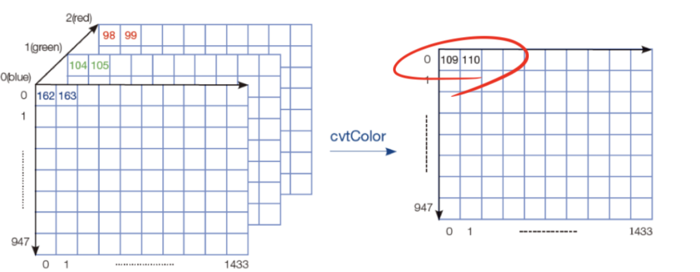

# 이미지 불러오기 및 Grayscale 변환

이 프로젝트는 Python과 OpenCV를 사용하여 컬러 이미지를 흑백으로 변환하고, 원본 이미지와 흑백 이미지를 나란히 이어 붙여 한 화면에 비교 출력하는 간단한 예제입니다.

## 📌 주요 기능
* **이미지 읽기 및 예외 처리**: `cv.imread()`를 사용해 로컬 경로의 이미지를 불러오고, 파일이 없을 경우 안전하게 종료합니다.
* **색상 공간 변환**: `cv.cvtColor()`를 사용해 BGR 컬러 이미지를 Grayscale(흑백) 이미지로 변환하고 파일로 저장합니다.


* **채널 확장 및 이미지 병합**: 채널 수가 다른 두 이미지(3채널 컬러, 1채널 흑백)를 병합하기 위해 흑백 이미지의 채널을 확장한 후, `numpy.hstack`을 이용해 가로로 이어 붙입니다.
* **이미지 출력**: `cv.imshow()`와 `cv.waitKey()`를 사용해 완성된 이미지를 윈도우 창에 띄워 확인합니다.

## 🛠️ 요구 사항
코드를 실행하기 전에 아래 라이브러리가 설치되어 있어야 합니다.

```bash
pip install opencv-python numpy
```

## 🛠️ 주요 코드 설명
```python
img1 = cv.imread('soccer.jpg')
```
📁 'soccer.jpg' 파일을 읽어서 img1 변수에 저장합니다.

```python
img2 = cv.cvtColor(img1, cv.COLOR_BGR2GRAY)
```

🎨 컬러(BGR) 이미지를 흑백(Gray) 이미지로 변환하여 img2에 저장합니다.

여기는 이미지 붙힐 예정

```python
img2_3channel = cv.cvtColor(img2, cv.COLOR_GRAY2BGR)
```
🔄 흑백 이미지(1채널)를 다시 BGR(3채널) 형식으로 변환합니다. (이미지 결합을 위해 채널 수를 맞추는 필수 작업)

```python
img3 = np.hstack((img1, img2_3channel))
```
🔗 원본 이미지와 3채널 흑백 이미지를 가로로 이어 붙여 img3을 생성합니다.


