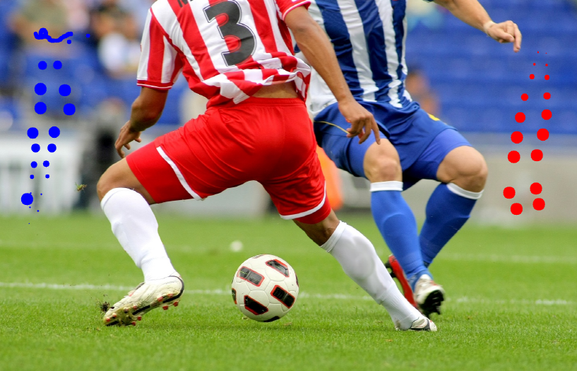

# 페인팅 붓 크기 조절 기능 추가

이 프로젝트는 OpenCV의 마우스 이벤트 처리 기능을 활용하여
이미지 위에 직접 그림을 그릴 수 있는 간단한 Paint 프로그램입니다.

사용자는 마우스를 이용해 드래그로 그림을 그릴 수 있으며,
좌클릭과 우클릭을 통해 서로 다른 색상의 브러시를 사용할 수 있습니다.
또한 키보드 입력을 통해 브러시 크기를 실시간으로 조절할 수 있습니다.

# 📌 주요 기능 (Features)

### 1️⃣ 마우스 드로잉
마우스 클릭 후 드래그를 하면 이미지 위에 연속적으로 원을 그려 **선처럼 보이는 브러시 효과**를 구현합니다.

### 2️⃣ 색상 변경
마우스 버튼에 따라 서로 다른 색상의 브러시를 사용할 수 있습니다.

- 좌클릭 → 파란색 브러시  
- 우클릭 → 빨간색 브러시

### 3️⃣ 브러시 크기 조절
키보드 입력을 통해 브러시 크기를 실시간으로 변경할 수 있습니다.

- `+` : 브러시 크기 증가  
- `-` : 브러시 크기 감소

### 4️⃣ 프로그램 종료
`q` 키를 눌러 프로그램을 안전하게 종료할 수 있습니다.

---

# 🛠️ 요구 사항 (Requirements)

프로그램을 실행하기 위해 아래 라이브러리가 필요합니다.

```bash
pip install opencv-python numpy
```

---

# 📂 프로젝트 구조

```
project/
│
├── paint.py
├── soccer.jpg
├── img/
│   └── paint_result.png
└── README.md
```

| 파일 | 설명 |
|-----|-----|
| paint.py | 메인 실행 코드 |
| soccer.jpg | 캔버스로 사용할 이미지 |
| img/paint_result.png | 실행 결과 이미지 |
| README.md | 프로젝트 설명 |

---

# ▶ 실행 방법 (How to Run)

```bash
python paint.py
```

프로그램 실행 후 **마우스를 이용하여 이미지 위에 직접 그림을 그릴 수 있습니다.**

## 🕹️ 조작 방법 (Controls)

| 조작 | 기능 설명 |
|---|---|
| **마우스 좌클릭 + 드래그** | 🔵 파란색 브러시로 그리기 |
| **마우스 우클릭 + 드래그** | 🔴 빨간색 브러시로 그리기 |
| **키보드 `+`** | 붓 크기 증가 (최대 15) |
| **키보드 `-`** | 붓 크기 감소 (최소 1) |
| **키보드 `q`** | 프로그램 종료 |

# 🧠 주요 코드 설명

## 1️⃣ 마우스 이벤트 처리

```python
cv.setMouseCallback("Paint", mouse_event)
```

OpenCV에서 제공하는 **마우스 콜백 함수**를 사용하여  
마우스 클릭, 드래그, 이동 등의 이벤트가 발생할 때  
`mouse_event()` 함수가 자동으로 호출되도록 설정합니다.

---

## 2️⃣ 브러시 드로잉

```python
cv.circle(img, (x, y), brush_size, color, -1)
```

현재 마우스 위치 `(x, y)`에 **채워진 원을 그리는 함수**입니다.

| 파라미터 | 의미 |
|---|---|
| `(x,y)` | 마우스 좌표 |
| `brush_size` | 브러시 크기 |
| `color` | 브러시 색상 |
| `-1` | 내부가 채워진 원 |

마우스를 이동하면서 계속 원을 그리기 때문에 **선처럼 보이는 효과**가 나타납니다.

---

## 3️⃣ 브러시 크기 조절

```python
if key == ord('+'):
    brush_size = min(15, brush_size + 1)
```

`cv.waitKey()`를 이용해 키보드 입력을 감지하고  
`+` 또는 `-` 키가 눌리면 브러시 크기를 변경합니다.

`min()`과 `max()` 함수를 이용해 **브러시 크기 범위를 제한합니다.**

---

# 💻 실행 결과



이미지를 캔버스로 사용하여 마우스로 그림을 그릴 수 있습니다.

---

# ✏️ 정리

이 프로젝트는 OpenCV의 **마우스 이벤트 처리와 실시간 이미지 업데이트 기능을 학습하기 위한 예제 프로그램**입니다.

이를 통해 다음 개념을 이해할 수 있습니다.

- OpenCV 마우스 이벤트 처리
- 실시간 그래픽 인터랙션
- 키보드 입력 처리
- 이미지 기반 캔버스 구현
