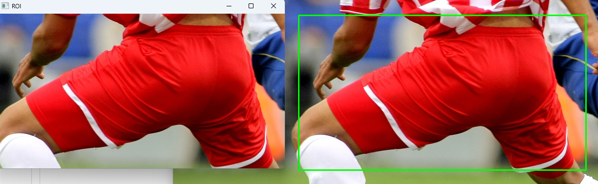
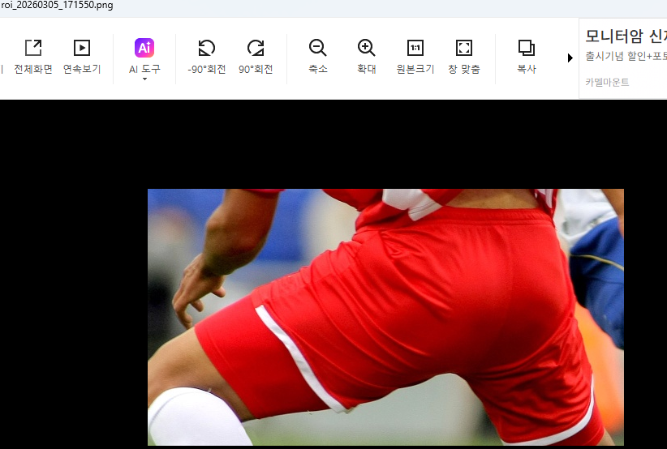
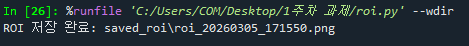

# 🖼️ 마우스 드래그 영역 선택 및 저장

이 프로젝트는 **OpenCV를 활용하여 이미지에서 원하는 영역(ROI, Region of Interest)을 마우스로 선택하고 저장할 수 있는 프로그램**입니다.

사용자는 마우스를 드래그하여 이미지의 특정 영역을 선택할 수 있으며,  
선택된 영역은 별도의 창에서 확인할 수 있고 파일로 저장할 수도 있습니다.

또한 드래그 방향이 어떤 방향이든 정상적으로 영역이 선택되도록  
**좌표 정규화(Normalization)** 기능을 구현했습니다.

---

# 📌 주요 기능 (Features)

### 1️⃣ 마우스 드래그로 ROI 선택
마우스를 클릭한 후 드래그하여 이미지의 특정 영역을 선택할 수 있습니다.

### 2️⃣ 드래그 방향 자동 처리 (좌표 정규화)
좌상 → 우하 방향뿐 아니라  
우하 → 좌상, 좌하 → 우상 등 **어떤 방향으로 드래그해도 정상적으로 영역을 인식**합니다.

### 3️⃣ 실시간 선택 영역 표시
마우스를 드래그하는 동안 선택된 영역을 **초록색 사각형(Bounding Box)**으로 표시합니다.

### 4️⃣ ROI 독립 창 출력
마우스를 놓으면 선택된 ROI가 **별도의 "ROI" 창에 표시**됩니다.

### 5️⃣ 타임스탬프 기반 자동 저장
`s` 키를 누르면 선택한 ROI를 저장합니다.

저장 특징

- `saved_roi` 폴더 자동 생성
- 시간 기반 파일명 생성
- 파일 중복 방지

예시

```
roi_20260305_153210.png
```

### 6️⃣ 초기화 기능
`r` 키를 누르면 선택 영역이 **원본 이미지 상태로 리셋**됩니다.

---

# 🛠️ 요구 사항 (Requirements)

다음 라이브러리가 필요합니다.

```bash
pip install opencv-python numpy
```

사용된 모듈

- OpenCV
- NumPy
- os
- sys
- datetime

---

# 📂 프로젝트 구조

```
project/
│
├── roi_select.py
├── soccer.jpg
├── saved_roi/
├── img/
│   ├── roi.png
│   ├── log.png
│   └── save.png
└── README.md
```

| 파일 | 설명 |
|-----|-----|
| roi_select.py | 메인 실행 코드 |
| soccer.jpg | 테스트용 이미지 |
| saved_roi | 저장된 ROI 이미지 |
| img | README 설명용 이미지 |
| README.md | 프로젝트 설명 |

---

# ▶ 실행 방법 (How to Run)

```bash
python roi_select.py
```

프로그램 실행 후 마우스를 이용하여 **이미지에서 원하는 영역을 선택할 수 있습니다.**

---

# 🎮 조작 방법 (Controls)

| 조작 | 기능 |
|---|---|
| 마우스 좌클릭 + 드래그 | ROI 영역 선택 |
| 마우스 버튼 해제 | ROI 선택 완료 |
| 키보드 `s` | ROI 이미지 저장 |
| 키보드 `r` | 선택 영역 초기화 |
| 키보드 `q` | 프로그램 종료 |

---

# 🧠 주요 코드 설명

## 1️⃣ 드래그 방향 처리 (좌표 정규화)

```python
def normalize_rect(ax, ay, bx, by, w, h):
    x_min = max(0, min(ax, bx))
    y_min = max(0, min(ay, by))
    x_max = min(w - 1, max(ax, bx))
    y_max = min(h - 1, max(ay, by))
```

사용자가 드래그하는 방향이

- 좌상 → 우하
- 우하 → 좌상
- 좌하 → 우상

등 어떤 방향이든 **항상 올바른 사각형 좌표로 변환**합니다.

또한 마우스가 이미지 밖으로 나가도 오류가 발생하지 않도록  
이미지 크기(`w`, `h`) 범위 내로 좌표를 제한합니다.

---

## 2️⃣ ROI(관심 영역) 추출

```python
roi = base[ry0:ry1, rx0:rx1].copy()
```

NumPy 배열 슬라이싱을 이용하여  
원본 이미지에서 선택된 영역만 잘라내어 ROI를 생성합니다.



---

## 3️⃣ 안전한 폴더 생성 및 파일 저장

```python
save_dir = "saved_roi"
os.makedirs(save_dir, exist_ok=True)
```

`saved_roi` 폴더가 없을 경우 자동으로 생성합니다.

---

## 4️⃣ 타임스탬프 기반 파일 저장

```python
ts = datetime.now().strftime("%Y%m%d_%H%M%S")
save_path = os.path.join(save_dir, f"roi_{ts}.png")
```

현재 시간을 파일명에 포함하여 **파일 덮어쓰기를 방지**합니다.

예시

```
roi_20260305_153210.png
```



---

# 💻 실행 화면

### ROI 선택


### 저장 로그



---

# ✏️ 정리

이 프로젝트는 OpenCV의 **마우스 이벤트 처리 기능을 활용하여 이미지에서 관심 영역(ROI)을 선택하고 저장하는 프로그램**입니다.

이를 통해 다음 개념을 이해할 수 있습니다.

- OpenCV 마우스 이벤트 처리
- 이미지 좌표 처리
- NumPy 이미지 슬라이싱
- 파일 저장 자동화
- 타임스탬프 기반 파일 관리
